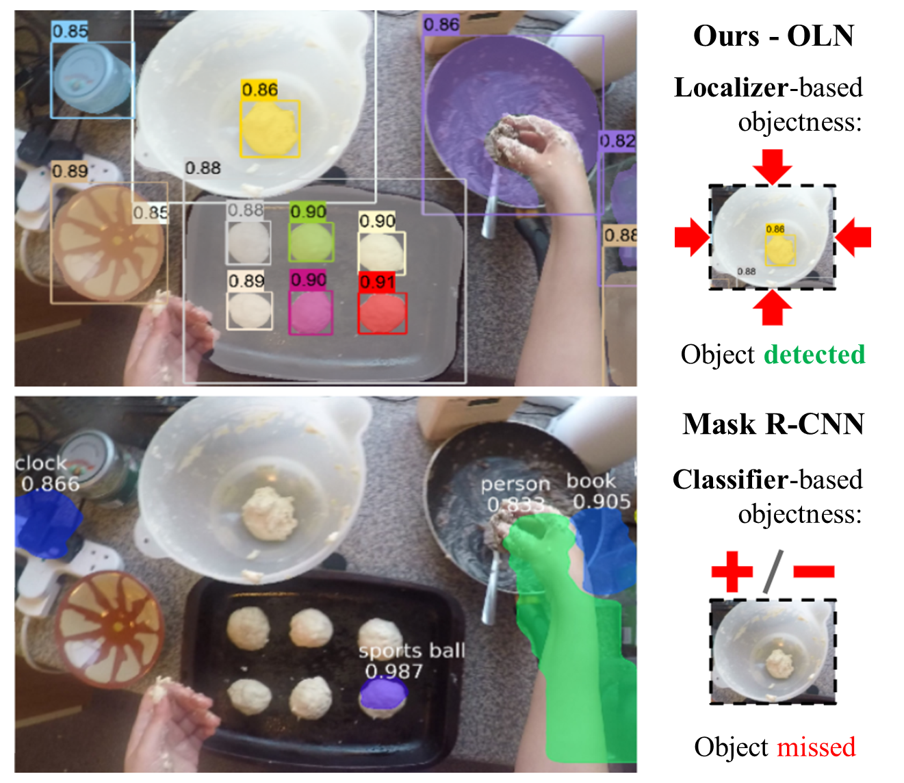
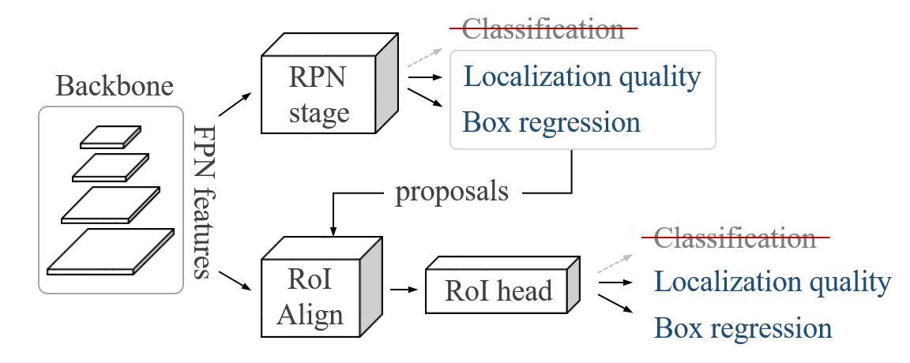

# Learning Open-World Object Proposals without Learning to Classify

## Pytorch implementation for "Learning Open-World Object Proposals without Learning to Classify" ([arXiv 2021](https://arxiv.org/abs/2108.06753)) <br/>

[Dahun Kim](https://mcahny.github.io/), [Tsung-Yi Lin](https://scholar.google.com/citations?user=_BPdgV0AAAAJ), [Anelia Angelova](https://scholar.google.co.kr/citations?user=nkmDOPgAAAAJ), [In So Kweon](https://rcv.kaist.ac.kr), and [Weicheng Kuo](https://weichengkuo.github.io/).

```bibtex
@article{kim2021oln,
  title={Learning Open-World Object Proposals without Learning to Classify},
  author={Kim, Dahun and Lin, Tsung-Yi and Angelova, Anelia and Kweon, In So and Kuo, Weicheng},
  journal={IEEE Robotics and Automation Society},
  year={2022}
}
```


## Introduction

Humans can recognize novel objects in this image despite having never seen them  before. “Is it possible to learn open-world (novel) object proposals?” In this paper we propose **Object Localization Network (OLN)** that learns localization cues instead of foreground vs background classification. Only trained on COCO, OLN is able to propose many novel objects (top) missed by Mask R-CNN (bottom) on an out-of-sample frame in an ego-centric video.

  <br/>

## Cross-category generalization on COCO

We train OLN on COCO VOC categories, and test on non-VOC categories. Note our AR@k evaluation does not count those proposals on the 'seen' classes into the budget (k), to avoid evaluating recall on see-class objects.

|     Method     |  AUC  | AR@10 | AR@30 | AR@100 | AR@300 | AR@1000 | Download |
|:--------------:|:-----:|:-----:|:-----:|:------:|:------:|:-------:|:--------:|
|    OLN-Box     | 24.8  | 18.0  | 26.4  |  33.4  |  39.0  |  45.0   | [model](https://drive.google.com/uc?id=1uL6TRhpSILvWeR6DZ0x9K9VywrQXQvq9) |


## Disclaimer

This repo is tested under Python 3.7, PyTorch 1.7.0, Cuda 11.0, and mmcv==1.2.5.

## Installation

This repo is built based on [mmdetection](https://github.com/open-mmlab/mmdetection). 

You can use following commands to create conda env with related dependencies.
```
conda create -n oln python=3.7 -y
conda activate oln
conda install pytorch=1.7.0 torchvision cudatoolkit=11.0 -c pytorch -y
pip install mmcv-full
pip install -r requirements.txt
pip install -v -e . 
```
Please also refer to [get_started.md](docs/get_started.md) for more details of installation.


## Prepare datasets

COCO dataset is available from official websites. It is recommended to download and extract the dataset somewhere outside the project directory and symlink the dataset root to $OLN/data as below.
```
object_localization_network
├── mmdet
├── tools
├── configs
├── data
│   ├── coco
│   │   ├── annotations
│   │   ├── train2017
│   │   ├── val2017
│   │   ├── test2017

```


## Testing
Our trained models are available for download [here](https://drive.google.com/uc?id=1uL6TRhpSILvWeR6DZ0x9K9VywrQXQvq9). Place it under `trained_weights/latest.pth` and run the following commands to test OLN on COCO dataset.

```
# Multi-GPU distributed testing
bash tools/dist_test_bbox.sh configs/oln_box/oln_box.py \
trained_weights/latest.pth ${NUM_GPUS}
# OR
python tools/test.py configs/oln_box/oln_box.py work_dirs/oln_box/latest.pth --eval bbox
```


## Training
```
# Multi-GPU distributed training
bash tools/dist_train.sh configs/oln_box/oln_box.py ${NUM_GPUS}

```


## Contact

If you have any questions regarding the repo, please contact Dahun Kim (mcahny01@gmail.com) or create an issue.
